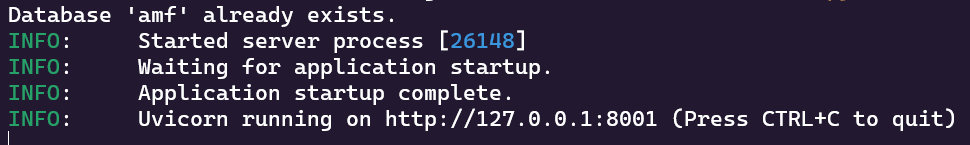
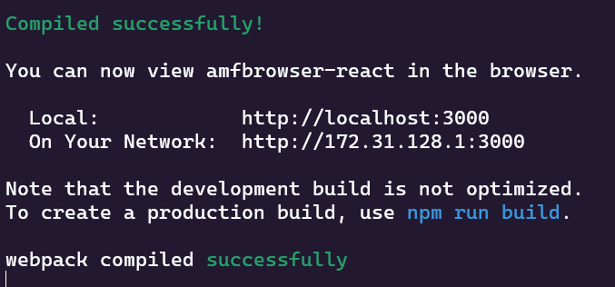

#  MycorrhizaFinder installation instructions

## Packaged executables

The simplest way to run the tool is via the included executables - these are available for Windows, Mac & Linux, and give you access to the latest version of the tool (v5.0.0). In order to run the tool locally using these executables, the only thing you need to download on top of this is a PostgreSQL database for storing predictions and annotations. Detailed installation instructions for this are included below.

### Installing postgres

You can install postgres via the official website [here](https://www.postgresql.org/download/). Select the relevant operating system and follow the download instructions. One thing to note here is that the tool defaults to the `postgres` user having the password `postgres`. If you choose a different password when installing the program (which you will be prompted to do when downloading postgres) then you can override this default by passing a flag `--db-password` to the executable when you run it, but you will have to do this every single time you spin up the program. The relevant command is below.

`./amf.exe --db-password example-password`

### Running the executable

Once you have downloaded postgres and started the service on your machine (this should be automatic), you can run the tool by simply double clicking the executable for your OS. This will open a web browser window at the address http://127.0.0.1:8001 - you are now ready to use the tool and all it's functionalities!

_Note_: if you experience the application freezing or getting stuck loading, this is likely an issue with the cmd prompt and not the application! Cmd prompt in windows has an option called "mark mode" that intentionally freezes the buffer to allow you to copy text, and if you click into the window that the exe opens it might trigger this. In order to disable this, you can turn off Quick Edit mode in the console settings - [this post](https://stackoverflow.com/questions/13599822/command-prompt-gets-stuck-and-continues-on-enter-key-press) will show you how to do that. You can also always unfreeze the exe by clicking the cmd prompt and hitting enter.

## For developers

If you are wanting to make edits to the code of the tool, then you can run the tool using node (for the React UI) and Python 3.11.9 for the amfinder code. The steps for doing so are as below.

1. Install **node** from the [official website](https://nodejs.org/en/download) - version 22.13.1 is compatible with the current version of the tool. For Windows, we would recommend downloading the .msi installer instead of using `fnm`. You can validate this worked by checking that the following command in terminal returns the corresponding version you have downloaded `node --version`.
2. Install **Python 3.11** from the [official website](https://www.python.org/downloads/) or from your package manager. We would recommend ticking the box asking whether you would like to add this to path. After the install, when you open a terminal and run `python --version`, the output should be `3.11.*`.
3. `cd` to the `amf\amf_code` folder.
4. Run the following set of commands (note that line 2 is how to activate a virtualenv on Windows - if you are on linux, this will differ. See [here](https://docs.python.org/3/library/venv.html#how-venvs-work) for details).

```
python -m venv amfenv
.\amfenv\Scripts\activate
python -m pip install --upgrade pip
python -m pip install -r ./requirements.txt
python ./main.py
```

5. You should see the below output in your terminal, which means your python code is running successfully (note that if it is your first time running this the first line will be different, as it will create the amf database in your running postgres instance).

<p>
  
</p>

6. Now, leave this running and open a new terminal. `cd` to the `amfbrowser-react` folder.
7. Run the following commands:

```
npm install
npm start
```

8. You should see the following output in your terminal.

<p>
  
</p>

9. Now you have the React UI and python backend running, you can go ahead and start developing! Just open http://localhost:3000 to access the tool.

Note: if you are running the React UI, in order for it to connect to the backend, you will need to change the `IS_DEV` global variable in main.py to True and then restart this script. This will set up cors correctly for development purposes.

## Linux installation tips

In order to install on Linux, you will likely need to install the python dev package, libpq-dev, gcc for psycopg2 to work - you can do this with the following (note that we are using python3.11 in the below).

````
sudo apt install python3.11-dev
sudo apt install libpq-dev
sudo apt install build-essential
```

You may also need to switch your python version to 3.11 - you can use deadsnakes for this as below.

````

sudo add-apt-repository ppa:deadsnakes/ppa
sudo apt update
sudo apt install python3.11

```

Python will then be accessible using `python3.11`.
```
