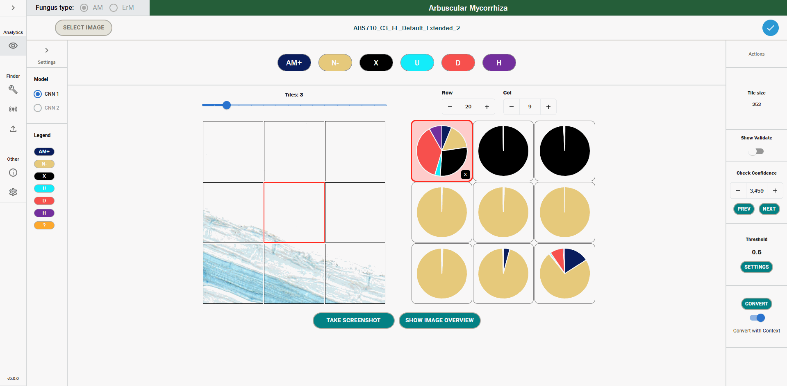
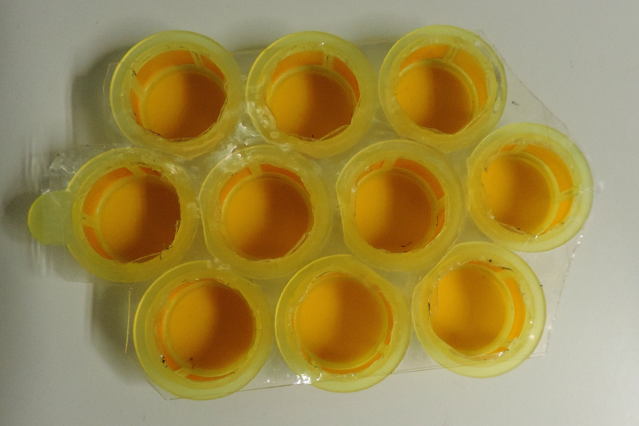
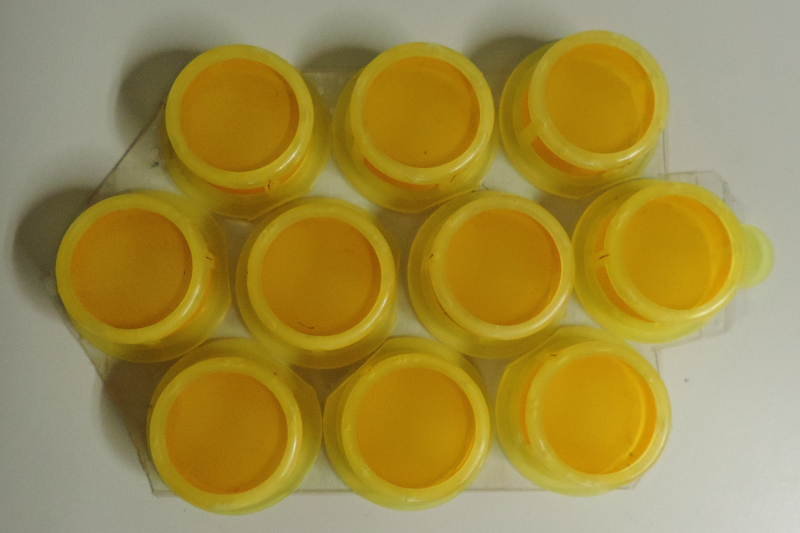
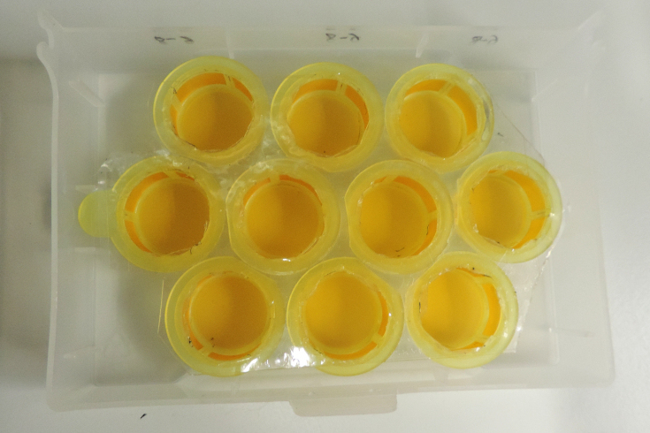

  

The MycorrhizaFinder tool allows for high-throughput computervision-based identification and quantification of AM (Arbuscular Mycorrhiza) and ErM (Ericoid Mycorrhiza) fungal colonisationand intraradical hyphal structures using convolutional neural networks.

**The current version of MycorrhizaFinder is v5.0.0.**

If you use MycorrhizaFinder in your manuscript, please cite:
[Evangelisti _et al._, 2021, Deep learning-based quantification of arbuscular mycorrhizal fungi in plant roots, _New Phytologist_ **232**(5): 2207-2219](https://doi.org/10.1111/nph.17697).

## Summary

1. [Installation](#install)
1. [Overview of functionality](#overview)
1. [For Developers](#develop)
1. [How to batch stain plant roots?](#staining)

## Installation

Detailed installation instructions for Linux, Mac and Windows can be found [here](INSTALL.md).

## Overview of functionality

The purpose of MycorrhizaFinder is to enable the identification and quantification of Arbuscular and Ericoid colonisation in root specimens. As such, the tool can be split into two main areas of functionality:

1. MycorrhizaFinder Tool - this allows users to calculate predictions using an AI network which tile an image, and for each tile, output probabilities for each tile that it belongs to one of n classes. Moreover, users can use this functionality to train new networks, and also automatically convert predictions into annotations, which are tiled images that have been assigned a label per tile, and other functionalities that are specified below.
2. Browser - this section of the tool allows users to view predictions made by MycorrhizaFinder, convert these into annotations and manually add/edit annotations to a tiled image.

The usual functionality of the tool is via the UI - this has exhaustive user documentation which can be found at doc/mycorrhiza-finder-user-documentation.pdf. However, you can run the MF tool functionalities directly from the console, which is useful for development purposes. This functionality is outlined in [develop](DEVELOP.md).

  

## For Developers

If you are planning on developing new code in the tool and want to run the amf functionalities without using the UI, details on this can be found [here](DEVELOP.md).

## How to batch stain plant roots?

An optimised ink-staining protocol with additional clearing is available in [Evangelisti _et al._ (2021)](https://doi.org/10.1111/nph.17697).

**Batch staining plant roots is essential for high-throughput analyses.** It can be achieved using a hand-crafted device composed of 10 cell strainers (100 µm nylon mesh) tied together with adhesive sealing film for PCR plates. A single sieve can accommodate a 4-week-old _N. benthamiana_ root system. The sieves containing roots are immersed in 10% KOH, water, or ink/vinegar staining solution poured in a plastic lid. Plastic lids are floated in a hot (95°C) water bath to achieve the desired staining conditions. Sieves are pulled out of the lid containing the KOH solution and transferred to the washing solution, then to the ink staining solution without the need to manipulate roots, thereby reducing the risk of damage.

| View from above                | View from below                | With plastic lid               |
| ------------------------------ | ------------------------------ | ------------------------------ |
|  |  |  |

Credit: devices from Dr [Albin Teulet](https://twitter.com/albinteulet) and [Alex Guyon](https://twitter.com/alexwguyon) (Schornack lab), derived from an original idea by Dr Clément Quan.
